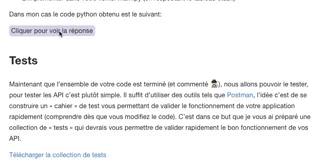

# Click To Reveal Plugin

[](https://www.npmjs.com/package/gitbook-plugin-click-reveal)

Simple plugin to add  « Click to Reveal » functionnality to your GitBook.



## Installation

In your book.json add the plugin:

```json
{
    "plugins": [
        "click-reveal"
    ]
}
```

## Usage

Quick use :

```

Your element to **hide**

```

With custom text :

```

Your element to **hide**

```